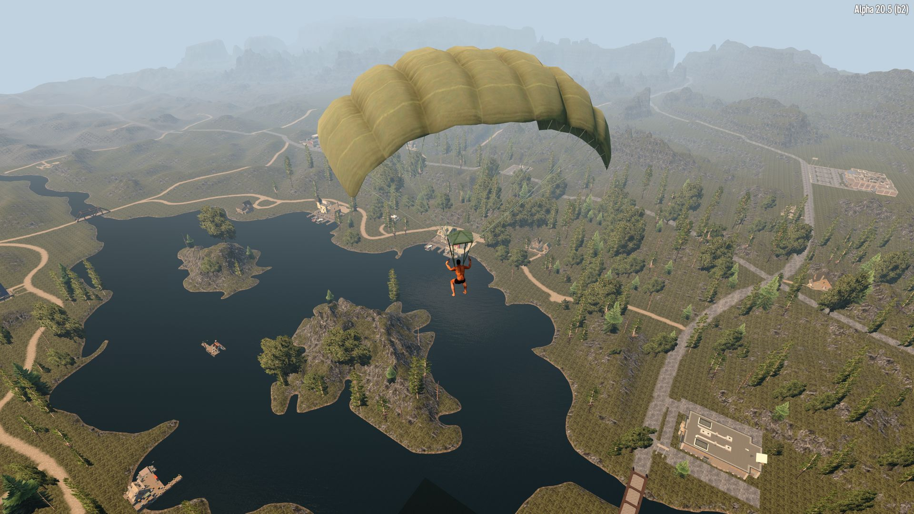

# OCB Parachute Mod - 7 Days to Die (A21) Addon

Adds a Parachute you can deploy when Mid-Air. Unlocked with
Armor Craftin Skill Level 50. You need to craft the Backpack
and put it into your chest armor in order to use deployable
parachute items from your hotbar. Needs EAC Disabled!

Required on client and server for multiplayer (WIP).

[![GitHub CI Compile Status][4]][3]

## Download and Install

Simply [download here from GitHub][2] and put into your A21 Mods folder:

- https://github.com/OCB7D2D/OcbParachute/releases (master branch)

## Changelog

### Version 0.4.0

- Update compatibility for 7D2D A21.0(b324)

### Version 0.2.1

- Add item action to deploy parachute
- Improve undead legacy compatibility

### Version 0.2.0

- Fix multi-player support
- Change key to `left ctrl`
- Show message a bit later

### Version 0.1.0

- Initial work in progress version

## Compatibility

Developed initially for version a20.5(b2), updated through A21.0(b324).

[1]: https://github.com/OCB7D2D/OcbParachute
[2]: https://github.com/OCB7D2D/OcbParachute/releases
[3]: https://github.com/OCB7D2D/OcbParachute/actions/workflows/ci.yml
[4]: https://github.com/OCB7D2D/OcbParachute/actions/workflows/ci.yml/badge.svg

